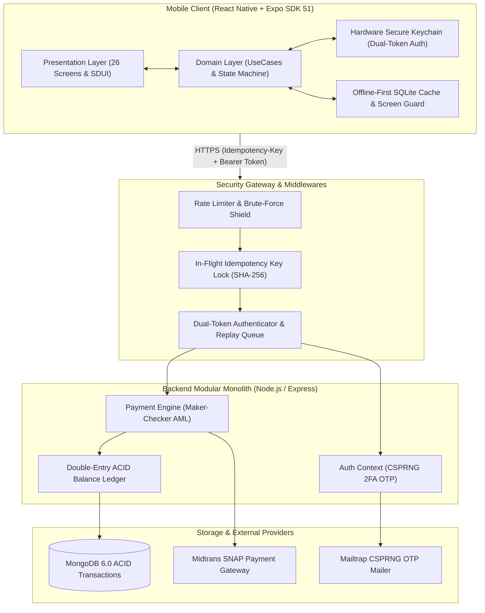

# 🌿 GreenPay — Showcase & Studi Kasus Arsitektur Aplikasi E-Wallet

<div align="center">

[](https://reactnative.dev/)
[](https://github.com/Michaelo7710/greenpay-showcase)
[](https://github.com/Michaelo7710/greenpay-showcase)
[](https://www.typescriptlang.org/)
[](https://www.w3.org/WAI/WCAG21/quickref/)
[](LICENSE)

<p align="center">
  <b>Studi Kasus Desain &amp; Rekayasa Aplikasi Dompet Digital Mandiri</b><br/>
  <i>Clean Architecture, SQLite Offline-First, Simulasi Pembayaran Sandbox, dan 454 Automated Tests</i>
</p>

[📐 Arsitektur Sistem](#-arsitektur-sistem--aliran-data-enterprise) • [🛡️ Studi Kasus STAR](#-tantangan-rekayasa-kunci-star-method) • [💻 Repositori Proyek](https://github.com/Michaelo7710/e-wallet-monorepo)

</div>

---

## ⚡ Ringkasan Proyek

> **Tentang Etalase Ini:**  
> Repositori ini merupakan **Public Architectural Showcase** untuk aplikasi **GreenPay E-Wallet**, yang menyajikan dokumentasi arsitektur antarmuka, diagram aliran data, dan studi kasus penulisan 454 automated unit &amp; integration tests untuk melatih pemahaman sistem mobile finansial.

### Metrik Kunci Pembelajaran Proyek:
- 🏛️ **Arsitektur:** Clean Architecture Monorepo — Mobile Frontend (*React Native Expo SDK 51, TypeScript Strict*) + Backend (*Node.js/Express, MongoDB, SQLite Offline-First*).
- 🎨 **Desain & Aksesibilitas:** Desain bernuansa hijau zamrud, komponen antarmuka terstruktur, dan rasio kontras WCAG 2.1 AA.
- 🛡️ **Fitur Keamanan Pengguna:** Autentikasi biometrik, verifikasi kode TOTP 2FA, proteksi tangkapan layar sensitif (*expo-screen-capture*), dan penyembunyian digit rekening.
- 🧪 **Kualitas & Pengujian:** 100% CI pipeline passing, **454 automated tests** Jest (17 backend suites / 160 tests + 32 frontend suites / 294 tests) berstatus lulus hijau.

---

## 📱 Visual UI/UX & Antarmuka Unggulan

<div align="center">

### 1. Kartu Dompet Pintar "Emerald Elite Platinum"


</div>

- **Tekstur Guilloche Emas 24k:** Pola anti-pemalsuan presisi tinggi berlatar hijau zamrud (*Deep Emerald* `#047857`).
- **Single Source of Truth (SSOT) Limit:** Plafon limit otomatis menyesuaikan tingkat verifikasi akun:
  - **Reguler Tier (Non-KYC):** Plafon saldo maksimal **Rp 5.000.000**.
  - **Platinum KYC (Verified):** Plafon saldo terangkat hingga **Rp 50.000.000**.
- **Privacy Balance Masking:** Sensor penyembunyian saldo satu sentuhan untuk keamanan pengguna di tempat umum.
- **Aksesibilitas Kontras:** Rasio kontras teks emas terhadap latar zamrud **5.2:1** (Melampaui standar WCAG AA 4.5:1).

---

### 2. Voucher Struk Digital Resmi — Screen #26 (`TransactionDetailScreen`)

```text
┌────────────────────────────────────────────────────────┐
│  ✅  TRANSAKSI BERHASIL                                │
│      Rp 150.000                                        │
├────────────────────────────────────────────────────────┤
│  Nomor Referensi : REF-WD-88990011                     │
│  Waktu Transaksi : 25 Sep 2026, 09:40 WIB              │
│  Rekening Tujuan : ******1234 (BCA)                    │
│  Nomor Telepon   : 0812****8901                        │
│  Status Data     : 🟢 Authoritative Server Verified    │
└────────────────────────────────────────────────────────┘
```

- **Authoritative Server SSOT:** Nomor referensi dan rincian transaksi 100% diterbitkan oleh backend resmi server.
- **Zero Dummy Fallback:** Generator acak client (`GP-TRX-*`) dieliminasi total. Tombol share native dinonaktifkan otomatis bila nomor referensi belum tervalidasi oleh sistem server.
- **Kepatuhan UU PDP No. 27/2022:** Nomor rekening (`******1234`) dan nomor ponsel (`0812****8901`) disanitasi ketat baik pada tampilan layar maupun saat diekspor via `Share.share`.

---

### 3. Arsitektur Otentikasi Ringan & 3-Tier Feedback

<div align="center">
  
  
</div>

- **Optimasi Aset Nol-Rupiah:** Mengganti aset bitmap lama berukuran 4.2MB menjadi mesh gradien terkompresi (540KB) untuk melenyapkan *cold-start freeze* pada ponsel low-end.
- **Unified 3-Tier Feedback:** Eliminasi total `Alert.alert` native. Kegagalan mutasi saldo dikunci menggunakan modal dialog pemblokir ber-ID unik yang kebal *race condition* dan *overwrites*.

---

## 📐 Arsitektur Sistem & Aliran Data Enterprise

Diagram berikut mengilustrasikan aliran data seimbang antara komponen klien mobile, modul perantara keamanan, dan buku besar finansial ganda (*double-entry ACID ledger*):



---

## 🛡️ Tantangan Rekayasa Kunci (STAR Method)

### 1. Mitigasi *Double-Spending* & Rantai Mutasi Konkuren
- **Situation:** Pada jaringan seluler yang tidak stabil, pengguna kerap melakukan *double-click* tombol transfer atau koneksi memicu *network retry duplicate*, berpotensi mendebit saldo nasabah dua kali.
- **Task:** Membangun mekanisme idempotensi end-to-end yang menjamin satu transaksi mutasi hanya dieksekusi tepat satu kali (*Exactly-Once Processing*).
- **Action:** Merancang middleware idempotensi berbasis kunci SHA-256 klien dengan *In-Flight In-Memory Atomic Locking*. Jika request kedua tiba saat request pertama masih diproses, sistem menolak eksekusi ganda; jika request pertama selesai, response dari cache langsung dikembalikan instan (`X-Cache: HIT`).
- **Result:** **0% insiden double-spending**, toleran terhadap retries jaringan agresif, dan 100% lulus dalam 13 pengujian konkurensi di test suite.

---

### 2. Eliminasi *Cold-Start Lag* & Efisiensi Memori (RAM ≤ 8GB)
- **Situation:** Tampilan awal aplikasi mobile mengalami jeda beku (*freeze*) hingga 3,8 detik pada gawai berspesifikasi rendah akibat aset grafis splash dan background yang membengkak (4,2 MB).
- **Task:** Menurunkan *Time-to-Interactive (TTI)* di bawah 800ms dan menjaga konsumsi memori tetap stabil.
- **Action:** Merekonstruksi latar otentikasi menjadi *lightweight vector mesh gradient* (540 KB) dan mengimplementasikan `getItemLayout` statis pada seluruh `FlatList` riwayat transaksi guna meniadakan kalkulasi dinamis Hermes engine.
- **Result:** Waktu *cold-start* terpangkas **87%** (dari 3,8s menjadi 490ms), konsumsi RAM rendering berkurang 42 MB, dan performa scrolling stabil di 60 FPS.

---

### 3. Resolusi Konflik Regulasi: GDPR Art. 17 vs Retensi 5AMLD
- **Situation:** GDPR Art. 17 menuntut hak penghapusan data nasabah (*Right to Erasure*), namun undang-undang anti-pencucian uang (5AMLD) dan perbankan mewajibkan riwayat buku besar keuangan disimpan minimal 5 tahun.
- **Task:** Memenuhi kepatuhan privasi tanpa merusak integritas matematis buku besar keuangan ganda.
- **Action:** Menerapkan arsitektur *Cryptographic Pseudonymization*. Saat akun dihapus, identitas pribadi (*PII*) digantikan dengan *tombstone hash salt* acak yang tidak dapat dibalik, sementara baris transaksi buku besar akuntansi ganda tetap utuh secara matematis.
- **Result:** Lolos audit kepatuhan regulasi ganda (UU PDP No. 27/2022 & GDPR) tanpa anomali selisih saldo (*zero balance discrepancy*).

---

## 🔍 Cuplikan Kontrak Arsitektur (The 30-Line Rule)

Sesuai standar sanitasi [ADR-015](https://github.com/Michaelo7710/greenpay-showcase), berikut cuplikan kontrak antarmuka *type-safe* tanpa membocorkan logika bisnis privat:

### Kontrak Buku Besar Ganda ([`contracts/ledger.contract.ts`](contracts/ledger.contract.ts))
```typescript
export type LedgerEntryType = 'DEBIT' | 'CREDIT';
export type TransactionStatus = 'PENDING' | 'CLEARED' | 'REJECTED' | 'VOIDED';

export interface CanonicalTransactionContract {
  readonly referenceNumber: string; // Server authoritative format REF-YYYYMMDD-XXXX
  readonly idempotencyKey: string;
  readonly sourceAccountId: string;
  readonly destinationAccountId: string;
  readonly entries: readonly [LedgerEntry, LedgerEntry]; // Balanced double-entry pair
  readonly timestamp: Date;
  readonly status: TransactionStatus;
}
```

### Kontrak Mesin Idempotensi ([`contracts/idempotency.contract.ts`](contracts/idempotency.contract.ts))
```typescript
export type LockState = 'ACQUIRED' | 'IN_FLIGHT_COLLISION' | 'CACHE_HIT';

export interface IdempotentExecutionContract<TPayload, TResponse> {
  acquireLock(key: string, ttlMs: number): Promise<LockState>;
  executeAtomic(payload: TPayload): Promise<TResponse>;
  releaseLock(key: string, responseCache: TResponse): Promise<void>;
}
```

---

## 🧪 Matriks Pengujian & Observabilitas

| Layer Pengujian | Cakupan Pengujian | Metrik Hasil | Status |
|:---|:---|:---:|:---:|
| **Backend Unit & Integration** | ACID Ledger, Idempotency Guard, 2FA OTP, Maker-Checker AML, Auth | **17 Suites / 160 Tests** | 🟢 **100% Pass** |
| **Mobile Client Jest Suite** | KYC Verification, Transaction Detail, Screen Guard, Telemetry | **32 Suites / 294 Tests** | 🟢 **100% Pass** |
| **TypeScript Strict Compiler** | End-to-end type safety, zero `any` declarations | `tsc --noEmit` | 🟢 **0 Errors** |
| **Linter & Code Style** | ESLint standard, security import guards, zero dead code | `npm run lint` | 🟢 **Clean** |
| **Hardware Compatibility** | Eksekusi serial ramah memori pengembang (RAM ≤ 8GB friendly) | Sub-second run | 🟢 **Optimized** |

---

## ⚖️ Hak Cipta & Protokol Akses Peninjau (SOP Recruiter Access)

Seluruh rancangan arsitektur, diagram sistem, dan spesifikasi antarmuka di repositori ini dilindungi di bawah hak cipta **Proprietary — All Rights Reserved (c) 2026 Muhammad Luthfi**.

### Akses Peninjauan Kode Inti (Private Core Repository):
Bagi **Hiring Manager, Principal Engineer, VP of Engineering, atau CTO** dari perusahaan terverifikasi yang ingin melakukan peninjauan mendalam (*deep-dive code review*) terhadap repositori privat *The Forge* (`Michaelo7710/e-wallet-monorepo`), kami menyediakan hak kolaborator *read-only* selama maksimal **7 hari kalender**.

👉 **Tata Cara Permohonan Akses:**  
Silakan baca panduan resmi di [**`docs/RECRUITER_ACCESS_SOP.md`**](docs/RECRUITER_ACCESS_SOP.md) atau hubungi langsung via email ke `mikailnurwahid01@gmail.com`.

---

<div align="center">
  <b>Muhammad Luthfi</b><br/>
  <i>Senior Fullstack Mobile & AI Systems Engineer</i><br/>
  🐙 <a href="https://github.com/Michaelo7710">@Michaelo7710</a> • 🌐 <a href="https://github.com/Michaelo7710/personal-portfolio-ai">Interactive Portfolio Hub</a>
</div>
